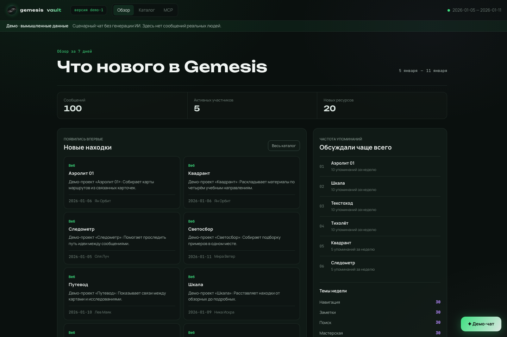
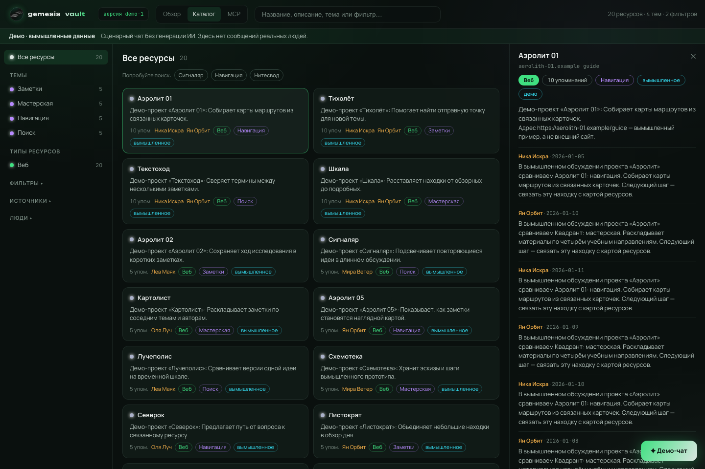
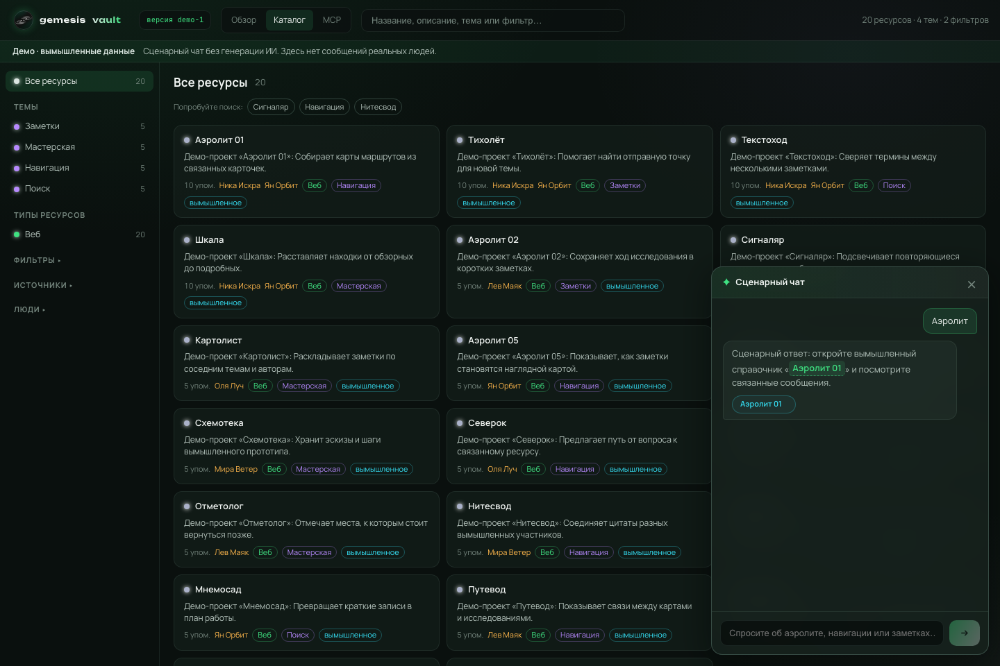

# Gemesis Vault — карта знаний / knowledge map

**Интерактивное публичное демо:** превращает сообщения и ссылки в каталог ресурсов и сводку. Можно искать, фильтровать карточки, открывать упоминания и подключить MCP. **Все данные вымышлены.**

**Interactive public demo:** explore a knowledge catalogue, weekly digest, resource cards, searchable mentions and read-only MCP. **Every person, message and resource is fictional.**

**[Открыть демо / Open the live demo ↗](https://gemesis-vault-demo.onrender.com/)** · Render Free: после простоя запуск может занять около минуты / waking after inactivity may take about a minute.

> **Полная версия / Full product:** ИИ-чат генерирует ответы на вопросы по базе знаний / an AI chat generates answers using the knowledge base. **Публичное демо / Public demo:** отдельное приложение с вымышленными данными и **сценарным чатом без генерации ИИ / scripted replies, no AI calls**. Оно не подключено к закрытой базе или VPS. Здесь нет админки, записи, регистрации или настоящих внешних ссылок: адреса `.example` — только примеры.

## Что можно попробовать / Explore

| Возможность / Feature | Что происходит / What it does |
| --- | --- |
| **Обзор / Digest** | Сводка за фиксированную демонстрационную неделю: 100 сообщений, 20 ресурсов, 5 вымышленных авторов. / A fixed fictional week with trends and discoveries. |
| **Каталог / Catalogue** | Поиск по названиям и описаниям, фильтры по темам и авторам, карточки с контекстом упоминаний. / Search and filter resources, then open their mention history. |
| **MCP + FTS5** | Пять реальных read-only инструментов, включая полнотекстовый поиск по вымышленным сообщениям. / Five working read-only tools, including message full-text search. |
| **Демо-чат / Scripted chat** | Подготовленные ответы на три темы со ссылками на карточки; другие вопросы получают честную подсказку. / Three scripted topics with citations and an explicit fallback. |

## Скриншоты / Screenshots

Сняты **только с локально запущенного демо и вымышленных данных**; нажмите для просмотра в полном размере. / Captured solely from the local fictional demo; click to enlarge.

| Обзор / Overview | Каталог и упоминания / Catalogue & mentions |
| --- | --- |
| [](screenshots/overview.png) | [](screenshots/catalog.png) |

**Сценарный чат / Scripted chat** — ответы помечены как подготовленные, а ссылки открывают вымышленные карточки. / Replies are clearly marked as scripted and cite fictional resource cards.

<a href="screenshots/chat.png"></a>

## Как устроено / Architecture

```text
Детерминированная синтетическая выборка / deterministic fictional seed
                 ↓
       SQLite + FTS5 (runtime read-only)
                 ↓
   FastAPI (allowlisted HTTP + MCP)
         ↙                       ↘
 React/Vite: обзор, каталог          5 read-only MCP tools
         ↖                       ↙
    Сценарный чат / scripted responses
```

- `demo/seed.py` строит одинаковую SQLite-базу при каждом запуске; она живёт во временной директории. `demo/catalog.py` собирает сводку и связи; `demo/chat.py` хранит только заранее написанные ответы.
- `demo/app.py` выдаёт только каталог, ресурс, сводку, обновления, демо-чат и MCP. Пользовательские запросы открывают SQLite в режиме **read-only**; никаких Telegram-сессий, внешней синхронизации или рабочей инфраструктуры.
- `app/src/` — React-интерфейс. `Dockerfile` собирает фронтенд и запускает FastAPI непривилегированным пользователем; `.dockerignore` закрыт по умолчанию. `render.yaml` описывает ровно один **Render Free** web service без постоянного диска.

**EN:** The seed produces the same ephemeral SQLite/FTS5 corpus on every boot. FastAPI serves an allowlisted HTTP API and five read-only MCP tools; React renders the catalogue and digest. The Docker runtime contains only reviewed demo files. There is no connection to production, persistent user data or paid AI in this public demo.

## Запуск / Run locally

Python 3.12+, Node 22+ and pnpm 11.24.0 are required. No accounts or secret keys are needed.

```sh
python3 -m venv .venv
.venv/bin/python -m pip install -r requirements-demo.txt
cd app && pnpm install --frozen-lockfile && pnpm build && cd ..
PORT=8000 .venv/bin/python -m demo.launch
# open http://127.0.0.1:8000/
```

Or: `docker build -t gemesis-demo . && docker run --rm -p 8000:10000 -e PORT=10000 gemesis-demo`.

### MCP: пять инструментов / Five tools

`search_messages`, `search_resources`, `get_resource`, `list_topics`, `top_resources` работают на том же вымышленном наборе данных. / All five tools query the same fictional corpus.

Local endpoint: `http://127.0.0.1:8000/mcp`; hosted endpoint: `https://gemesis-vault-demo.onrender.com/mcp`. Public **demo-only** bearer: `demo-readonly` (not an owner key or a secret). The MCP tab supplies client-specific setup commands. Requests are size- and rate-limited; do not send private questions or credentials to a public demo.

## Проверки и ограничения / Verification & limits

```sh
.venv/bin/python -m unittest discover -s tests -q
.venv/bin/python -m scripts.check_public_artifact
.venv/bin/python -m scripts.check_history
cd app && pnpm exec tsc --noEmit && pnpm build && pnpm exec playwright test
```

CI also audits dependencies, checks the Docker image contents and exercises HTTP/MCP from a real container. Render Free can sleep after inactivity and take roughly a minute to wake; its database is recreated, not persisted. All displayed dates, names and URLs are illustrative. / Checks include secret and history scans, responsive browser tests, dependency audits and container smoke tests. Free-tier restarts reset the fictional dataset.
